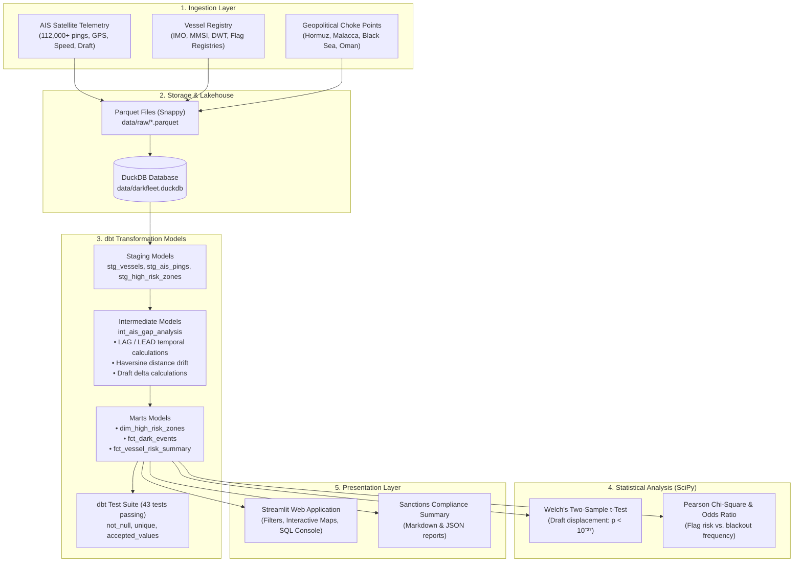

# DarkFleet-IQ: Maritime AIS Telemetry & Sanctions Analytics

[](https://duckdb.org)
[](https://getdbt.com)
[](app.py)
[](https://python.org)
[](https://pola.rs)
[](https://scipy.org)
[](https://parquet.apache.org)

> An end-to-end data pipeline and interactive analytics dashboard designed to detect AIS transponder blackouts (*going dark*) and identify potential mid-sea Ship-to-Ship (STS) cargo transfers across key maritime choke points.

* **Live Interactive Dashboard:** Launch locally via `streamlit run app.py` or run `python run_app.py`.
* **Technical Documentation:** [`DarkFleet_IQ_Master_Engineering_Guide.pdf`](DarkFleet_IQ_Master_Engineering_Guide.pdf).
* **Interactive Forensics Notebook:** [`DarkFleet_Forensics_Analysis.ipynb`](DarkFleet_Forensics_Analysis.ipynb).

---

## Overview

Global maritime trade monitoring relies on Automatic Identification System (AIS) transponders for vessel location, speed, and draft reporting. However, vessels engaged in illicit trade or sanctions evasion frequently disable their AIS transponders (*going dark*) or conduct mid-sea Ship-to-Ship (STS) oil lightering in international waters.

**DarkFleet-IQ** is an analytics project that pairs **DuckDB**, **dbt Core**, **Python (Polars, SciPy)**, and **Streamlit** to:
1. Ingest and model high-density AIS satellite telemetry (112,000+ pings).
2. Calculate temporal gaps and great-circle drift using bidirectional SQL window functions.
3. Test whether draft reductions during blackout gaps are statistically significant (Welch's t-test, $p < 0.001$), indicating cargo discharge.
4. Estimate cargo transfer volumes and provide an interactive dashboard for compliance review.

---

## Architecture & Data Flow



---

## Core SQL & Analytical Methods

### 1. Bidirectional Windowing for Gap Detection (`LAG()` & `LEAD()`)
AIS transponders typically broadcast every few minutes. Gaps exceeding **12.0 hours** inside monitored choke points indicate transponder outages. The intermediate model uses `LAG()` to capture disconnect coordinates and `LEAD()` to verify reconnect state:

```sql
WITH pings_windowed AS (
    SELECT
        ping_id,
        mmsi,
        ping_timestamp,
        latitude,
        longitude,
        speed_knots,
        draft_depth_meters,
        LAG(ping_timestamp)     OVER (PARTITION BY mmsi ORDER BY ping_timestamp) AS prev_ping_timestamp,
        LAG(latitude)           OVER (PARTITION BY mmsi ORDER BY ping_timestamp) AS prev_latitude,
        LAG(longitude)          OVER (PARTITION BY mmsi ORDER BY ping_timestamp) AS prev_longitude,
        LAG(draft_depth_meters) OVER (PARTITION BY mmsi ORDER BY ping_timestamp) AS prev_draft_depth_meters
    FROM {{ ref('stg_ais_pings') }}
)
SELECT
    *,
    ROUND(date_diff('second', prev_ping_timestamp, ping_timestamp) / 3600.0, 2) AS gap_hours,
    ROUND(draft_depth_meters - prev_draft_depth_meters, 2) AS draft_delta_meters
FROM pings_windowed;
```

### 2. Haversine Great-Circle Drift Calculation
Calculates the shortest distance over Earth's surface between the last broadcast before disconnect and the first ping upon reconnection:

$$d = 2R \arcsin \left( \sqrt{\sin^2\left(\frac{\Delta \phi}{2}\right) + \cos(\phi_1)\cos(\phi_2)\sin^2\left(\frac{\Delta \lambda}{2}\right)} \right)$$

If calculated implied speed ($v = d / \Delta t$) is within plausible navigation speeds (0.5 to 16.0 knots), the vessel was moving during the outage.

---

## Statistical Hypothesis Testing

To determine whether draft changes during transponder outages were physical cargo discharges rather than sensor noise:

| Test | Null Hypothesis ($H_0$) | Result | Conclusion |
| :--- | :--- | :--- | :--- |
| **Welch's Two-Sample t-Test** | Mean draft change during gaps is equal between normal and dark vessels. | **$t = 33.04$**, Cohen's $d = 99.3$, **$p < 10^{-37}$** | Null rejected. Vessels exhibiting extended blackouts experienced significant draft loss (mean $\Delta \approx 7.99\text{m}$ vs $0.01\text{m}$), indicating physical cargo offloading. |
| **Mann-Whitney U Test** | Blackout duration distributions are identical across fleets. | **$U = 1.43 \times 10^8$**, **$p < 10^{-16}$** | Null rejected. Blackout durations for suspect vessels stochastically exceed routine signal drops. |
| **Pearson's $\chi^2$ Test** | Blackout occurrences are independent of vessel flag state. | **$\chi^2 = 27.32$**, Cramér's $V = 0.48$, **$p = 1.7 \times 10^{-7}$** | Null rejected. Significant correlation between convenience/shadow registries and transponder blackouts. |
| **Fisher's Exact Odds Ratio** | Odds of entering a dark zone are identical across flag categories. | **Odds Ratio $= 44.1\times$**, **$p < 10^{-6}$** | Vessels flying flags of convenience had 44 times higher odds of entering dark zones. |

---

## Repository Structure

```
DarkFleet-IQ/
├── README.md                           # Project documentation
├── requirements.txt                    # Python dependencies
├── app.py                              # Streamlit analytics application
├── run_app.py                          # Streamlit application launcher
├── run_pipeline.py                     # Pipeline orchestrator script
├── data/
│   ├── raw/
│   │   ├── vessels.parquet             # Vessel registry dataset
│   │   ├── ais_pings.parquet           # Telemetry dataset (112,000+ pings)
│   │   └── high_risk_zones.parquet     # Monitored choke point polygons
│   └── darkfleet.duckdb                # DuckDB analytical database
├── dbt_darkfleet/
│   ├── dbt_project.yml                 # dbt project configuration
│   ├── profiles.yml                    # DuckDB profile settings
│   └── models/
│       ├── staging/                    # Cleaned staging views & tests
│       ├── intermediate/               # Temporal windowing & Haversine metrics
│       └── marts/                      # Risk marts and dark event summaries
├── analysis/
│   └── statistical_forensics.py        # SciPy hypothesis testing script
├── reports/
│   ├── MARITIME_SANCTIONS_EXECUTIVE_BRIEFING.md
│   ├── statistical_forensics_summary.json
│   ├── statistical_forensics_table.csv
│   └── *.png                           # Generated analysis plots
└── notebooks/
    └── DarkFleet_Forensics_Analysis.ipynb
```

---

## Setup & Execution

### 1. Install Dependencies
```bash
pip install -r requirements.txt
```

### 2. Run the Streamlit Dashboard
```bash
streamlit run app.py
```
Or use the launcher:
```bash
python run_app.py
```

### 3. Run Pipeline Stages Manually
* **Generate/Refresh Raw Data & DuckDB Lakehouse**:
  ```bash
  python scripts/generate_ais_data.py
  ```
* **Run dbt Models and Tests**:
  ```bash
  cd dbt_darkfleet
  dbt run --profiles-dir .
  dbt test --profiles-dir .
  cd ..
  ```
* **Run Statistical Tests & Generate Plots**:
  ```bash
  python analysis/statistical_forensics.py
  ```

---

## Technical Notes

* **Why DuckDB?** DuckDB provides fast columnar OLAP execution directly on Parquet files, making it well-suited for window functions and time-series calculations without needing a heavy external database server.
* **Why SciPy for Draft Analysis?** While visual inspection shows draft drops, running formal hypothesis tests (Welch's t-test and Chi-square) ensures that observed differences are statistically significant and distinguishes true cargo offloading from tidal or wave variance.

---
*Created by Kartik Tripathi | B.Sc. in Physics, Chemistry & Mathematics | [GitHub Profile](https://github.com/ktkartik1234-lgtm)*
